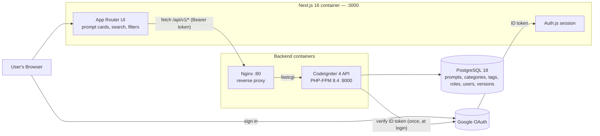
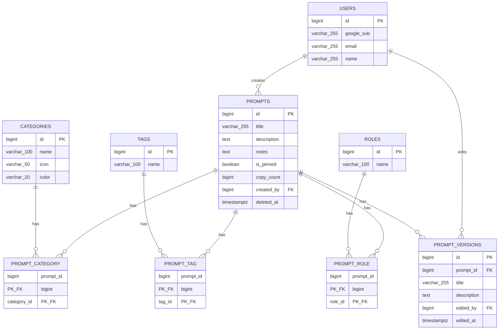

# Prompt Hub — Prompt Management System: Implementation Plan

A internal tool for storing, organizing, and quickly reusing prompts — searchable by category and tag, with one-click copy. Working name used throughout this doc: **Prompt Hub** (rename freely).

**Stack:** CodeIgniter 4 (PHP, REST API) · Next.js (UI) · PostgreSQL · Docker / Docker Compose

---

## Table of contents

1. [Scope & assumptions](#scope--assumptions)
2. [What this borrows from Claude Code's Prompt Library](#what-this-borrows-from-claude-codes-prompt-library)
3. [Tech stack](#tech-stack)
4. [Architecture](#architecture)
5. [Data model](#data-model)
6. [Backend — CodeIgniter 4 REST API](#backend--codeigniter-4-rest-api)
7. [Authentication — Google OAuth](#authentication--google-oauth)
8. [Frontend — Next.js UI](#frontend--nextjs-ui)
9. [Design system](#design-system)
10. [Docker setup](#docker-setup)
11. [API contract examples](#api-contract-examples)
12. [Roadmap](#roadmap)
13. [Testing strategy](#testing-strategy)
14. [Security & non-functional checklist](#security--non-functional-checklist)
15. [Decisions log](#decisions-log)

---

## Scope & assumptions

Most of round one's open questions are now settled — see the [Decisions log](#decisions-log) at the bottom. What's left are smaller implementation calls this plan makes on your behalf:

| Area | Assumption | Why |
|---|---|---|
| "PHP isn't compiled" | Two things now, both addressed: (1) PHP still runs through the standard interpreted PHP-FPM SAPI, not a static binary — unchanged from round one; (2) the Docker image itself is built from **precompiled** PHP and extension packages (`apk add php84-...`) instead of compiling extensions from source on every build (the old `docker-php-ext-install` approach) — see the [backend Dockerfile](#docker-setup). | Your follow-up made the ask more specific: not just "don't statically compile PHP," but "don't recompile anything when I rebuild the image." Both are now true. |
| Prompt ownership | `prompts.created_by` references `users`, nullable — but there's no roles/permissions system beyond "signed in with an allowed Google account" | You asked for Google OAuth "for auth," not for tiered permissions, so this stays exactly that simple. Flag it if you later want, say, only admins to manage categories. |
| Version history | Each edit stores a full snapshot (title + description), not a diff | Simpler to build and to display; cheap at this data size. |
| Search | Simple `LIKE` search over title + description | Still not addressed in your answers; noted as upgradeable to Postgres's native full-text search (`tsvector` + `GIN`) later. |
| Roles facet | A `roles` table structurally identical to `tags` (PM, Design, Security, Docs, …) | This is what the reference calls "roles" — a second, optional tagging dimension, kept separate from `tags` so the two facets can be filtered independently. |

---

## What this borrows from Claude Code's Prompt Library

Per your original request, I reviewed [code.claude.com/docs/en/prompt-library](https://code.claude.com/docs/en/prompt-library) before designing this. It's a curated, searchable collection of copy-paste prompts, organized along two dimensions: a broad workflow phase (discover/design/build/ship/operate) and a finer category within it (Git, Plan, Implement, Test, Review, Debug, Data, Automate, and others) — your own example categories ("Git, Plan, Build, Data") map almost exactly onto that category list. Each entry is a card that expands to show the full prompt text, a copy button, and a short note on why the prompt works; there's a search bar and clickable tag pills for filtering, plus a lightweight "roles" facet (PM, Design, Security, Docs, Marketing, Ops, Data) and a small curated "start here" set.

**Update: you approved all of the "optional enhancement" ideas from round one**, so they're no longer a side list — they're built into the [data model](#data-model) below and scheduled in the [roadmap](#roadmap):

| Idea | Now lives in |
|---|---|
| Slot-style `{placeholder}` prompts | `description` already supports it (no schema change) — fill-in UI is Phase 3 |
| "Why this works" notes | `prompts.notes` column — displayed in the card now (Phase 1) |
| Roles facet | `roles` + `prompt_role` tables — filterable alongside categories/tags (Phase 2) |
| Pinned "start here" prompts | `prompts.is_pinned` column — its own curated row (Phase 2) |
| Usage analytics | `prompts.copy_count`, incremented via `POST /prompts/{id}/copy` (Phase 1) |
| Version history | `prompt_versions` table, snapshotted on every edit — history view is Phase 3 |

What I'm still *not* carrying over, because it wasn't asked for: the three-level phase→category→role hierarchy (you only wanted category + tags + now roles — two/three flat facets, not a strict hierarchy).

---

## Tech stack

| Layer | Choice | Current version (Jul 2026) | Notes |
|---|---|---|---|
| Backend framework | CodeIgniter 4 | **4.7.x** (latest 4.7.4) | Requires PHP 8.1+; ships a native CORS filter and resource routing |
| Language / runtime | PHP | **8.4** | Installed as precompiled Alpine packages (`php84-*`) — nothing is built from source at image-build time |
| Database | PostgreSQL | **18.x** | Postgres doesn't have a MySQL-style LTS/Innovation split — every major version simply gets 5 years of support. 18 is the current stable line; 19 is still in beta (GA expected Sep/Oct 2026), so 18 is the right target today. |
| Frontend framework | Next.js | **16.x** (App Router) | Turbopack is the default bundler; ships with React 19.2 |
| Frontend runtime | Node.js | **24** (Active LTS) | Node 22 is now Maintenance LTS; Node 24 is the recommended line for new projects |
| Auth | Auth.js (`next-auth`) **v5** + Google provider | latest | Frontend drives the OAuth flow; the backend independently verifies Google's ID token and issues its own session |
| Backend JWT | `firebase/php-jwt` | latest | One small Composer package, used both to verify Google's ID token (via JWKS) and to sign the backend's own session tokens |
| Styling | Tailwind CSS v4 + shadcn/ui | latest | See [Design system](#design-system) |
| Icons | lucide-react | latest | |
| Cache | *(none for now)* | — | Starting without Redis, per your call — revisit in Phase 4 if read load ever justifies it |
| Reverse proxy | Nginx | 1.27+ (stable) | Fronts PHP-FPM |
| Containers | Docker + Docker Compose | — | Multi-stage builds; backend uses Alpine + `apk` for precompiled PHP rather than `docker-php-ext-install` |

---

## Architecture



*(Superseded by [Decisions log](#decisions-log) #6, #7, #9 below — kept here as the original design record.)* All five services (`api`, `nginx`, `web`, `db`, `pgadmin`) run on one Docker network (`prompthub_net`), defined in a single `docker-compose.yml` at the repo root, with the frontend and backend in separate directories (`frontend/`, `backend/`) so each keeps its own Dockerfile and dependency lockfile.

**As built:** three services (`api`, `nginx`, `web`) on network `prompt_ms_net`, container names `prompt-ms-*` — no containerized `db` (the api connects to a host-installed Postgres) and no `pgadmin`. See the real [`docker-compose.yml`](../docker-compose.yml) at the repo root.

---

## Data model



Category went from a single nullable column to its own pivot table per your answer — same pattern as `prompt_tag`, so filtering and syncing logic stay consistent across all three facets (category/tag/role).

### DDL

PostgreSQL 18 dialect. Create the database with `CREATE DATABASE prompt_hub WITH ENCODING 'UTF8';` — encoding is database-level in Postgres, not a per-table clause like MySQL's `CHARSET`. *(As built, the database is named `prompt_ms`, not `prompt_hub` — see [Decisions log](#decisions-log) #7.)*

```sql
-- Google-authenticated identities
CREATE TABLE users (
    id            BIGINT GENERATED ALWAYS AS IDENTITY PRIMARY KEY,
    google_sub    VARCHAR(255) NOT NULL,   -- Google's stable subject identifier
    email         VARCHAR(255) NOT NULL,
    name          VARCHAR(255),
    avatar_url    TEXT,
    created_at    TIMESTAMPTZ NOT NULL DEFAULT now(),
    last_login_at TIMESTAMPTZ,
    CONSTRAINT uq_users_google_sub UNIQUE (google_sub),
    CONSTRAINT uq_users_email UNIQUE (email)
);

CREATE TABLE categories (
    id          BIGINT GENERATED ALWAYS AS IDENTITY PRIMARY KEY,
    name        VARCHAR(100) NOT NULL,
    slug        VARCHAR(120) NOT NULL,
    icon        VARCHAR(50),            -- lucide-react icon name, e.g. "git-branch"
    color       VARCHAR(20),            -- hex, for the category badge
    created_at  TIMESTAMPTZ,
    updated_at  TIMESTAMPTZ,
    CONSTRAINT uq_categories_name UNIQUE (name),
    CONSTRAINT uq_categories_slug UNIQUE (slug)
);

CREATE TABLE tags (
    id          BIGINT GENERATED ALWAYS AS IDENTITY PRIMARY KEY,
    name        VARCHAR(100) NOT NULL,
    slug        VARCHAR(120) NOT NULL,
    created_at  TIMESTAMPTZ,
    updated_at  TIMESTAMPTZ,
    CONSTRAINT uq_tags_name UNIQUE (name),
    CONSTRAINT uq_tags_slug UNIQUE (slug)
);

CREATE TABLE roles (
    id          BIGINT GENERATED ALWAYS AS IDENTITY PRIMARY KEY,
    name        VARCHAR(100) NOT NULL,
    slug        VARCHAR(120) NOT NULL,
    created_at  TIMESTAMPTZ,
    updated_at  TIMESTAMPTZ,
    CONSTRAINT uq_roles_name UNIQUE (name),
    CONSTRAINT uq_roles_slug UNIQUE (slug)
);

CREATE TABLE prompts (
    id           BIGINT GENERATED ALWAYS AS IDENTITY PRIMARY KEY,
    title        VARCHAR(255) NOT NULL,
    description  TEXT NOT NULL,               -- the actual prompt content; may contain {slot} placeholders
    notes        TEXT,                        -- optional "why this works" explainer
    is_pinned    BOOLEAN NOT NULL DEFAULT FALSE,
    copy_count   BIGINT NOT NULL DEFAULT 0,
    created_by   BIGINT REFERENCES users(id) ON DELETE SET NULL,
    created_at   TIMESTAMPTZ,
    updated_at   TIMESTAMPTZ,
    deleted_at   TIMESTAMPTZ                  -- soft delete
);

CREATE INDEX idx_prompts_title     ON prompts (title);
CREATE INDEX idx_prompts_pinned    ON prompts (is_pinned) WHERE is_pinned = TRUE;

CREATE TABLE prompt_category (
    prompt_id    BIGINT NOT NULL REFERENCES prompts(id)    ON DELETE CASCADE,
    category_id  BIGINT NOT NULL REFERENCES categories(id) ON DELETE CASCADE,
    PRIMARY KEY (prompt_id, category_id)
);
CREATE INDEX idx_pc_category_id ON prompt_category (category_id);

CREATE TABLE prompt_tag (
    prompt_id  BIGINT NOT NULL REFERENCES prompts(id) ON DELETE CASCADE,
    tag_id     BIGINT NOT NULL REFERENCES tags(id)    ON DELETE CASCADE,
    PRIMARY KEY (prompt_id, tag_id)
);
CREATE INDEX idx_pt_tag_id ON prompt_tag (tag_id);

CREATE TABLE prompt_role (
    prompt_id  BIGINT NOT NULL REFERENCES prompts(id) ON DELETE CASCADE,
    role_id    BIGINT NOT NULL REFERENCES roles(id)   ON DELETE CASCADE,
    PRIMARY KEY (prompt_id, role_id)
);
CREATE INDEX idx_pr_role_id ON prompt_role (role_id);

CREATE TABLE prompt_versions (
    id           BIGINT GENERATED ALWAYS AS IDENTITY PRIMARY KEY,
    prompt_id    BIGINT NOT NULL REFERENCES prompts(id) ON DELETE CASCADE,
    title        VARCHAR(255) NOT NULL,
    description  TEXT NOT NULL,
    edited_by    BIGINT REFERENCES users(id) ON DELETE SET NULL,
    edited_at    TIMESTAMPTZ NOT NULL DEFAULT now()
);
CREATE INDEX idx_prompt_versions_prompt_id ON prompt_versions (prompt_id);
```

### Suggested seed data

Categories (drawn from the reference taxonomy, trim freely via the Categories UI):

`Onboard` · `Understand` · `Plan` · `Prototype` · `Build` · `Test` · `Refactor` · `Review` · `Git` · `Release` · `Debug` · `Data` · `Automate`

Roles (drawn from the reference's roles facet):

`PM` · `Design` · `Docs` · `Marketing` · `Security` · `Ops` · `Data`

---

## Backend — CodeIgniter 4 REST API

### Project structure

```
backend/
├── app/
│   ├── Config/
│   │   ├── Routes.php
│   │   ├── Cors.php
│   │   └── Filters.php
│   ├── Controllers/
│   │   └── Api/V1/
│   │       ├── AuthController.php
│   │       ├── PromptController.php
│   │       ├── CategoryController.php
│   │       ├── TagController.php
│   │       └── RoleController.php
│   ├── Filters/
│   │   └── AuthFilter.php
│   ├── Libraries/
│   │   └── AuthContext.php        # stashes the current user for the life of one PHP-FPM request
│   ├── Models/
│   │   ├── UserModel.php
│   │   ├── PromptModel.php
│   │   ├── PromptVersionModel.php
│   │   ├── CategoryModel.php
│   │   ├── TagModel.php
│   │   └── RoleModel.php
│   └── Database/
│       ├── Migrations/            # 9 total — see samples below
│       └── Seeds/
├── public/                  # web root (front controller)
├── writable/                # cache, logs, sessions — needs write perms
├── composer.json            # requires firebase/php-jwt
└── .env
```

### Routes

```php
<?php
// app/Config/Routes.php  (excerpt)

// Public probe — monitors/load balancers must reach it without a token.
$routes->get('api/v1/health', 'Api\V1\HealthController::index', ['filter' => 'cors']);

// Login itself can't require a token to get a token.
$routes->post('api/v1/auth/google', 'Api\V1\AuthController::google', ['filter' => 'cors']);

$routes->group('api/v1', ['namespace' => 'App\Controllers\Api\V1', 'filter' => ['cors', 'auth']], static function ($routes) {
    $routes->get('prompts',                 'PromptController::index');
    $routes->get('prompts/(:num)',          'PromptController::show/$1');
    $routes->post('prompts',                'PromptController::create');
    $routes->put('prompts/(:num)',          'PromptController::update/$1');
    $routes->delete('prompts/(:num)',       'PromptController::delete/$1');
    $routes->post('prompts/(:num)/copy',    'PromptController::trackCopy/$1');
    $routes->get('prompts/(:num)/versions', 'PromptController::versions/$1');

    $routes->get('categories',            'CategoryController::index');
    $routes->post('categories',           'CategoryController::create');
    $routes->put('categories/(:num)',     'CategoryController::update/$1');
    $routes->delete('categories/(:num)',  'CategoryController::delete/$1');

    $routes->get('tags',            'TagController::index');
    $routes->post('tags',           'TagController::create');
    $routes->put('tags/(:num)',     'TagController::update/$1');
    $routes->delete('tags/(:num)',  'TagController::delete/$1');

    $routes->get('roles',            'RoleController::index');
    $routes->post('roles',           'RoleController::create');
    $routes->put('roles/(:num)',     'RoleController::update/$1');
    $routes->delete('roles/(:num)',  'RoleController::delete/$1');

    $routes->options('(:any)', static function () {}); // CORS preflight
});
```

`CategoryController`, `TagController`, and `RoleController` are plain CRUD controllers over their respective models — the same `index`/`create`/`update`/`delete` shape as `PromptController`, minus any relation-syncing.

### Endpoint summary

| Method | Endpoint | Auth? | Purpose |
|---|---|---|---|
| GET | `/api/v1/health` | No | Liveness/readiness probe — reports API + DB status in the standard envelope (`200` healthy, `503` if the DB is unreachable) |
| POST | `/api/v1/auth/google` | No | Exchange a Google ID token for a Prompt Hub session token |
| GET | `/api/v1/prompts?search=&category=&tag=&role=&pinned=&page=&per_page=` | Yes | List prompts, filterable, **paginated (default `per_page=20`)** |
| GET | `/api/v1/prompts/{id}` | Yes | Single prompt with categories/tags/roles expanded |
| POST | `/api/v1/prompts` | Yes | Create (title, description, notes, category_ids[], tag_ids[], role_ids[]) |
| PUT | `/api/v1/prompts/{id}` | Yes | Update (also snapshots the prior version) |
| DELETE | `/api/v1/prompts/{id}` | Yes | Soft delete |
| POST | `/api/v1/prompts/{id}/copy` | Yes | Fire-and-forget: increments `copy_count` |
| GET | `/api/v1/prompts/{id}/versions` | Yes | Version history |
| GET/POST/PUT/DELETE | `/api/v1/categories[/{id}]` | Yes | Manage categories |
| GET/POST/PUT/DELETE | `/api/v1/tags[/{id}]` | Yes | Manage tags |
| GET/POST/PUT/DELETE | `/api/v1/roles[/{id}]` | Yes | Manage roles |

Every response uses one envelope: `{ "status": "success"|"error", "data": ..., "meta"?: {...}, "message"?: "..." }`.

### Model (validation + filtering)

```php
<?php
// app/Models/PromptModel.php

namespace App\Models;

use CodeIgniter\Model;

class PromptModel extends Model
{
    protected $table            = 'prompts';
    protected $primaryKey       = 'id';
    protected $useAutoIncrement = true;
    protected $returnType       = 'array';
    protected $useSoftDeletes   = true;
    protected $allowedFields    = ['title', 'description', 'notes', 'is_pinned', 'created_by'];
    protected $useTimestamps    = true;

    protected $validationRules = [
        'title'       => 'required|max_length[255]',
        'description' => 'required',
        'notes'       => 'permit_empty',
    ];

    public function scopeFilters(array $params)
    {
        $builder = $this->builder();

        if (!empty($params['category'])) {
            $builder->join('prompt_category pc', 'pc.prompt_id = prompts.id')->where('pc.category_id', $params['category']);
        }
        if (!empty($params['tag'])) {
            $builder->join('prompt_tag pt', 'pt.prompt_id = prompts.id')->where('pt.tag_id', $params['tag']);
        }
        if (!empty($params['role'])) {
            $builder->join('prompt_role pr', 'pr.prompt_id = prompts.id')->where('pr.role_id', $params['role']);
        }
        if (!empty($params['pinned'])) {
            $builder->where('is_pinned', true);
        }
        if (!empty($params['search'])) {
            $builder->groupStart()->like('title', $params['search'])->orLike('description', $params['search'])->groupEnd();
        }

        return $builder;
    }
}
```

### Controller (index/create/update + the two new endpoints)

```php
<?php
// app/Controllers/Api/V1/PromptController.php

namespace App\Controllers\Api\V1;

use App\Libraries\AuthContext;
use App\Models\PromptModel;
use App\Models\PromptVersionModel;
use CodeIgniter\RESTful\ResourceController;

class PromptController extends ResourceController
{
    protected $modelName = PromptModel::class;
    protected $format    = 'json';

    public function index()
    {
        $params  = $this->request->getGet(['category', 'tag', 'role', 'pinned', 'search', 'page', 'per_page']);
        $page    = max(1, (int) ($params['page'] ?? 1));
        $perPage = min(100, (int) ($params['per_page'] ?? 20)); // 20 = agreed default

        $builder = $this->model->scopeFilters($params)->where('deleted_at', null);
        $total   = $builder->countAllResults(false);
        $items   = $builder->orderBy('is_pinned', 'DESC')
                            ->orderBy('created_at', 'DESC')
                            ->get($perPage, ($page - 1) * $perPage)
                            ->getResultArray();

        return $this->respond([
            'status' => 'success',
            'data'   => $this->attachRelations($items),
            'meta'   => ['page' => $page, 'per_page' => $perPage, 'total' => $total],
        ]);
    }

    public function create()
    {
        $data = $this->request->getJSON(true);
        if (! $this->validateData($data, $this->model->validationRules)) {
            return $this->failValidationErrors($this->validator->getErrors());
        }

        $data['created_by'] = AuthContext::id();
        $id = $this->model->insert($data, true);

        $this->syncPivot('prompt_category', (int) $id, 'category_id', $data['category_ids'] ?? []);
        $this->syncPivot('prompt_tag',      (int) $id, 'tag_id',      $data['tag_ids'] ?? []);
        $this->syncPivot('prompt_role',     (int) $id, 'role_id',     $data['role_ids'] ?? []);

        return $this->respondCreated([
            'status' => 'success',
            'data'   => $this->attachRelations([$this->model->find($id)])[0],
        ]);
    }

    public function update($id = null)
    {
        $existing = $this->model->find($id);
        if (! $existing) {
            return $this->failNotFound();
        }

        // Snapshot the pre-edit version before overwriting.
        (new PromptVersionModel())->insert([
            'prompt_id'   => $id,
            'title'       => $existing['title'],
            'description' => $existing['description'],
            'edited_by'   => AuthContext::id(),
        ]);

        $data = $this->request->getJSON(true);
        $this->model->update($id, $data);

        $this->syncPivot('prompt_category', (int) $id, 'category_id', $data['category_ids'] ?? null);
        $this->syncPivot('prompt_tag',      (int) $id, 'tag_id',      $data['tag_ids'] ?? null);
        $this->syncPivot('prompt_role',     (int) $id, 'role_id',     $data['role_ids'] ?? null);

        return $this->respond(['status' => 'success', 'data' => $this->attachRelations([$this->model->find($id)])[0]]);
    }

    /** Fire-and-forget hit from the frontend's copy button — never blocks the actual clipboard copy. */
    public function trackCopy($id = null)
    {
        $this->model->builder()->where('id', $id)->increment('copy_count', 1);
        return $this->response->setStatusCode(204);
    }

    public function versions($id = null)
    {
        $versions = (new PromptVersionModel())->where('prompt_id', $id)->orderBy('edited_at', 'DESC')->findAll();
        return $this->respond(['status' => 'success', 'data' => $versions]);
    }

    /** Shared many-to-many sync helper for category_ids / tag_ids / role_ids. Pass null (not []) to leave a relation untouched on a partial update. */
    private function syncPivot(string $table, int $promptId, string $foreignKey, ?array $ids): void
    {
        if ($ids === null) {
            return;
        }
        $db = db_connect();
        $db->table($table)->where('prompt_id', $promptId)->delete();
        if ($ids) {
            $rows = array_map(static fn ($v) => ['prompt_id' => $promptId, $foreignKey => (int) $v], $ids);
            $db->table($table)->insertBatch($rows);
        }
    }

    /** Bulk-fetch categories/tags/roles for these prompt IDs and map them on — one query per relation, not per row. */
    private function attachRelations(array $prompts): array
    {
        return $prompts;
    }
}
```

*(Simplified for the spec — the real `attachRelations()` actually fetches and attaches the categories/tags/roles, and also casts `is_pinned`/`copy_count` to real bool/int since pdo_pgsql returns them as the strings `"t"`/`"f"`/`"123"`; see the gotcha in `.claude/CLAUDE.md`.)*

### Sample migrations

A "normal" table (the other four — `users`, `categories`, `tags`, `roles` — follow this shape):

```php
<?php
// app/Database/Migrations/2026-07-17-000001_CreatePromptsTable.php

namespace App\Database\Migrations;

use CodeIgniter\Database\Migration;

class CreatePromptsTable extends Migration
{
    public function up(): void
    {
        $this->forge->addField([
            'id'          => ['type' => 'BIGINT', 'auto_increment' => true],
            'title'       => ['type' => 'VARCHAR', 'constraint' => 255],
            'description' => ['type' => 'TEXT'],
            'notes'       => ['type' => 'TEXT', 'null' => true],
            'is_pinned'   => ['type' => 'BOOLEAN', 'default' => false],
            'copy_count'  => ['type' => 'BIGINT', 'default' => 0],
            'created_by'  => ['type' => 'BIGINT', 'null' => true],
            'created_at'  => ['type' => 'TIMESTAMP', 'null' => true],
            'updated_at'  => ['type' => 'TIMESTAMP', 'null' => true],
            'deleted_at'  => ['type' => 'TIMESTAMP', 'null' => true],
        ]);
        $this->forge->addKey('id', true);
        $this->forge->addForeignKey('created_by', 'users', 'id', 'CASCADE', 'SET NULL');
        $this->forge->createTable('prompts');
    }

    public function down(): void
    {
        $this->forge->dropTable('prompts');
    }
}
```

A pivot table (`prompt_tag` and `prompt_role` follow this same shape):

```php
<?php
// app/Database/Migrations/2026-07-17-000006_CreatePromptCategoryTable.php

namespace App\Database\Migrations;

use CodeIgniter\Database\Migration;

class CreatePromptCategoryTable extends Migration
{
    public function up(): void
    {
        $this->forge->addField([
            'prompt_id'   => ['type' => 'BIGINT'],
            'category_id' => ['type' => 'BIGINT'],
        ]);
        $this->forge->addPrimaryKey(['prompt_id', 'category_id']);
        $this->forge->addForeignKey('prompt_id', 'prompts', 'id', 'CASCADE', 'CASCADE');
        $this->forge->addForeignKey('category_id', 'categories', 'id', 'CASCADE', 'CASCADE');
        $this->forge->createTable('prompt_category');
    }

    public function down(): void
    {
        $this->forge->dropTable('prompt_category');
    }
}
```

### CORS

CodeIgniter 4 ships a native CORS filter — no extra package needed. Configure allowed origins in `app/Config/Cors.php` (make sure `Authorization` is included in `allowedHeaders`, since that's how the bearer token travels), register the `cors` alias in `app/Config/Filters.php`, and attach both `cors` and the new `auth` filter to the `api/v1` route group, as shown above. In production, set `allowedOrigins` to your real frontend origin(s) — never `*` once the app is reachable outside your network.

---

## Authentication — Google OAuth

Per your call, Google is the **only** sign-in method — no passwords, no other providers. The flow is split across both apps on purpose: Next.js drives the OAuth redirect/consent screen (that's what Auth.js is for), but the CodeIgniter API is the one that actually decides whether a request is authorized, by independently verifying Google's token rather than trusting whatever the frontend claims.

1. User clicks **Sign in with Google** in Next.js. Auth.js (the `next-auth` package, v5) handles the redirect, consent screen, and callback.
2. Once Auth.js has Google's ID token, the backend is called once — `POST /api/v1/auth/google` — to exchange it for a Prompt Hub session token.
3. CodeIgniter verifies the ID token's signature against Google's public keys (JWKS), checks the `aud` claim matches your Google Client ID, and — if you set `GOOGLE_ALLOWED_DOMAIN` — checks the `hd` (hosted domain) claim, so you can restrict sign-in to your company's Workspace domain without building your own invite system.
4. CodeIgniter issues its own short-lived signed JWT (1 hour in this plan) and either creates or updates a row in `users`. The frontend stores this token in the Auth.js session and attaches it as `Authorization: Bearer <token>` on every API call.
5. `AuthFilter` on the CodeIgniter side is the actual enforcement point, applied to the whole `api/v1` group except the login route itself.

**Why verification happens on the backend, not just the frontend:** a Next.js vulnerability class disclosed in 2025 showed that middleware-only route protection could be bypassed by spoofing an internal header — a reminder that Next.js middleware is a good UX convenience (redirect signed-out users to `/login` before they see a flash of protected content) but not a security boundary on its own. In this design, the actual boundary is `AuthFilter` rejecting any API request without a valid, signature-checked token — that holds regardless of what the frontend does or doesn't render.

### Frontend — Auth.js v5 config

```ts
// auth.ts (project root)
import NextAuth from 'next-auth';
import Google from 'next-auth/providers/google';

export const { handlers, auth, signIn, signOut } = NextAuth({
  providers: [Google],
  session: { strategy: 'jwt' },
  callbacks: {
    async jwt({ token, account }) {
      if (account?.id_token) {
        // Exchange Google's ID token for our own backend session token, once, at sign-in.
        const res = await fetch(`${process.env.API_BASE_URL}/auth/google`, {
          method: 'POST',
          headers: { 'Content-Type': 'application/json' },
          body: JSON.stringify({ id_token: account.id_token }),
        });
        const { data } = await res.json();
        token.backendToken = data.token;
      }
      return token;
    },
    async session({ session, token }) {
      session.backendToken = token.backendToken as string;
      return session;
    },
  },
});
```

```ts
// app/api/auth/[...nextauth]/route.ts
import { handlers } from '@/auth';
export const { GET, POST } = handlers;
```

```ts
// proxy.ts — UX redirect only; the real check is AuthFilter on the API
// (named middleware.ts in earlier drafts of this plan; Next.js 16 renamed the file
// convention to `proxy` — see Decisions log #10). The real file also short-circuits
// when NEXT_PUBLIC_SKIP_AUTH=true — simplified here.
export const proxy = auth((request) => {
  if (request.auth) return NextResponse.next();
  return NextResponse.redirect(new URL('/login', request.url));
});

export const config = {
  matcher: ['/((?!api/auth|login|_next/static|_next/image|favicon.ico).*)'],
};
```

Auth.js v5 auto-infers its Google credentials from `AUTH_GOOGLE_ID` / `AUTH_GOOGLE_SECRET`, and its signing secret from `AUTH_SECRET` (generate one with `npx auth secret`) — no need to name them manually in the config above.

### Backend — verifying the token and minting a session

```php
<?php
// app/Controllers/Api/V1/AuthController.php

namespace App\Controllers\Api\V1;

use App\Models\UserModel;
use CodeIgniter\RESTful\ResourceController;
use Firebase\JWT\JWK;
use Firebase\JWT\JWT;

class AuthController extends ResourceController
{
    public function google()
    {
        $idToken = $this->request->getJSON(true)['id_token'] ?? null;
        if (! $idToken) {
            return $this->failValidationErrors(['id_token' => 'required']);
        }

        try {
            // Google's JWKS response is long-lived; cache it in production instead of fetching every login.
            $googleKeys = json_decode(file_get_contents('https://www.googleapis.com/oauth2/v3/certs'), true);
            $claims     = JWT::decode($idToken, JWK::parseKeySet($googleKeys));
        } catch (\Throwable $e) {
            return $this->fail('Invalid Google token', 401);
        }

        if ($claims->aud !== env('GOOGLE_CLIENT_ID')) {
            return $this->fail('Token was not issued for this app', 401);
        }

        $allowedDomain = env('GOOGLE_ALLOWED_DOMAIN');
        if ($allowedDomain && ($claims->hd ?? '') !== $allowedDomain) {
            return $this->fail('This Google account is outside the allowed workspace', 403);
        }

        $user = (new UserModel())->upsertFromGoogle($claims); // find-or-create by google_sub

        $sessionToken = JWT::encode([
            'sub'   => $user['id'],
            'email' => $user['email'],
            'iat'   => time(),
            'exp'   => time() + 3600, // 1 hour
        ], env('APP_JWT_SECRET'), 'HS256');

        return $this->respond(['status' => 'success', 'data' => ['token' => $sessionToken, 'user' => $user]]);
    }
}
```

```php
<?php
// app/Filters/AuthFilter.php — the real enforcement point, applied to the whole api/v1 group

namespace App\Filters;

use App\Libraries\AuthContext;
use CodeIgniter\Filters\FilterInterface;
use CodeIgniter\HTTP\RequestInterface;
use CodeIgniter\HTTP\ResponseInterface;
use Firebase\JWT\JWT;
use Firebase\JWT\Key;

class AuthFilter implements FilterInterface
{
    public function before(RequestInterface $request, $arguments = null)
    {
        if (! preg_match('/^Bearer\s+(.+)$/', $request->getHeaderLine('Authorization'), $m)) {
            return service('response')->setJSON(['status' => 'error', 'message' => 'Missing bearer token'])->setStatusCode(401);
        }

        try {
            AuthContext::set(JWT::decode($m[1], new Key(env('APP_JWT_SECRET'), 'HS256')));
        } catch (\Throwable $e) {
            return service('response')->setJSON(['status' => 'error', 'message' => 'Invalid or expired session'])->setStatusCode(401);
        }
    }

    public function after(RequestInterface $request, ResponseInterface $response, $arguments = null) {}
}
```

```php
<?php
// app/Libraries/AuthContext.php — a static holder is safe here because PHP-FPM handles one
// request per process to completion; nothing leaks between requests the way it could on a
// long-running server (Swoole/RoadRunner), which is exactly the execution model this plan avoids.

namespace App\Libraries;

final class AuthContext
{
    private static ?object $user = null;

    public static function set(object $claims): void { self::$user = $claims; }
    public static function id(): ?int { return self::$user->sub ?? null; }
    public static function email(): ?string { return self::$user->email ?? null; }
}
```

Add the dependency with `composer require firebase/php-jwt`, and set `GOOGLE_CLIENT_ID`, `GOOGLE_ALLOWED_DOMAIN` (optional), and `APP_JWT_SECRET` in `backend/.env` (shown in full under [Docker setup](#docker-setup)).

---

## Frontend — Next.js UI

### Project structure

```
frontend/
├── app/
│   ├── layout.tsx
│   ├── page.tsx                         # dashboard: search + filters + card grid + pagination
│   ├── login/page.tsx                   # "Sign in with Google"
│   ├── api/auth/[...nextauth]/route.ts  # Auth.js route handler
│   ├── categories/page.tsx
│   ├── tags/page.tsx
│   └── roles/page.tsx
├── components/
│   ├── prompt-card.tsx
│   ├── category-badge.tsx
│   ├── tag-chip.tsx
│   ├── pagination.tsx
│   ├── search-bar.tsx
│   ├── filter-sidebar.tsx
│   └── prompt-form-dialog.tsx
├── lib/
│   ├── api.ts                 # fetch wrapper for the CI4 API
│   └── types.ts
├── auth.ts                    # Auth.js v5 config (see Authentication)
├── proxy.ts                    # route-protection UX (see Authentication; renamed from middleware.ts — Decisions log #10)
├── next.config.js             # output: 'standalone' (for the Docker build)
└── Dockerfile
```

### Types

```ts
// lib/types.ts
export interface Category { id: number; name: string; slug: string; icon?: string; color?: string; }
export interface Tag { id: number; name: string; slug: string; }
export interface Role { id: number; name: string; slug: string; }

export interface Prompt {
  id: number;
  title: string;
  description: string;
  notes?: string | null;
  isPinned: boolean;
  copyCount: number;
  categories: Category[];
  tags: Tag[];
  roles: Role[];
  createdAt: string;
  updatedAt: string;
}
```

### Prompt card

Shows categories and tags as badges (roles stay in the filter sidebar and the edit form rather than on every card — three badge rows on a compact card would fight the "lightweight, clean" brief more than it would help). A pinned prompt gets a small corner marker; a prompt with `notes` gets an expandable "why this works" line.

```tsx
// components/prompt-card.tsx
'use client';

import { useState } from 'react';
import { Copy, Check, Pin, Info } from 'lucide-react';
import type { Prompt } from '@/lib/types';
import { trackCopy } from '@/lib/api';
import { CategoryBadge } from './category-badge';
import { TagChip } from './tag-chip';

export function PromptCard({ prompt, token }: { prompt: Prompt; token: string }) {
  const [copied, setCopied] = useState(false);
  const [showNotes, setShowNotes] = useState(false);

  async function handleCopy() {
    try {
      await navigator.clipboard.writeText(prompt.description);
    } catch {
      // Fallback for browsers/contexts without the Clipboard API
      const el = document.createElement('textarea');
      el.value = prompt.description;
      el.style.position = 'fixed';
      el.style.opacity = '0';
      document.body.appendChild(el);
      el.select();
      document.execCommand('copy');
      document.body.removeChild(el);
    }
    setCopied(true);
    setTimeout(() => setCopied(false), 1500);
    trackCopy(prompt.id, token).catch(() => {}); // fire-and-forget — never blocks the copy itself
  }

  return (
    <div className="group relative rounded-xl border border-neutral-200 bg-white p-4 shadow-sm transition-shadow hover:shadow-md dark:border-neutral-800 dark:bg-neutral-900">
      {prompt.isPinned && (
        <Pin size={14} className="absolute -left-1.5 -top-1.5 rotate-45 text-teal-600" aria-label="Pinned — start here" />
      )}

      <div className="flex items-start justify-between gap-3">
        <h3 className="line-clamp-1 font-medium text-neutral-900 dark:text-neutral-100">{prompt.title}</h3>
        <button
          onClick={handleCopy}
          aria-label="Copy prompt to clipboard"
          className="shrink-0 rounded-md p-1.5 text-neutral-500 hover:bg-neutral-100 hover:text-neutral-900 dark:hover:bg-neutral-800"
        >
          {copied ? <Check size={16} className="text-green-600" /> : <Copy size={16} />}
        </button>
      </div>

      <p className="mt-2 line-clamp-3 whitespace-pre-line font-mono text-sm text-neutral-600 dark:text-neutral-400">
        {prompt.description}
      </p>

      {prompt.notes && (
        <button onClick={() => setShowNotes((v) => !v)} className="mt-2 flex items-center gap-1 text-xs text-teal-700 hover:underline dark:text-teal-400">
          <Info size={12} /> Why this works
        </button>
      )}
      {showNotes && <p className="mt-1 text-xs text-neutral-500 dark:text-neutral-400">{prompt.notes}</p>}

      <div className="mt-3 flex flex-wrap items-center gap-1.5">
        {prompt.categories.map((c) => <CategoryBadge key={c.id} category={c} />)}
        {prompt.tags.map((t) => <TagChip key={t.id} tag={t} />)}
      </div>
    </div>
  );
}
```

`{slot}` fill-in (Phase 3): when `description` contains `{token}`-style placeholders, the copy button instead opens a small `SlotFillDialog` with one input per unique token, and copies the description with the tokens substituted. Detection is a one-line regex (`/\{(\w+)\}/g`); the dialog itself is a straightforward controlled form, intentionally left for Phase 3 rather than designed in full here.

### Pagination (required, 20 per page by default)

```tsx
// components/pagination.tsx
'use client';

import { useRouter, useSearchParams } from 'next/navigation';

export function Pagination({ page, perPage, total }: { page: number; perPage: number; total: number }) {
  const router = useRouter();
  const params = useSearchParams();
  const lastPage = Math.max(1, Math.ceil(total / perPage));

  function goTo(p: number) {
    const next = new URLSearchParams(params);
    next.set('page', String(p));
    router.push(`/?${next.toString()}`);
  }

  return (
    <div className="mt-6 flex items-center justify-center gap-3 text-sm">
      <button disabled={page <= 1} onClick={() => goTo(page - 1)} className="rounded-md border px-3 py-1.5 disabled:opacity-40">Previous</button>
      <span className="text-neutral-500">Page {page} of {lastPage}</span>
      <button disabled={page >= lastPage} onClick={() => goTo(page + 1)} className="rounded-md border px-3 py-1.5 disabled:opacity-40">Next</button>
    </div>
  );
}
```

### API wrapper and server-rendered dashboard

```ts
// lib/api.ts
import type { Prompt } from './types';

// Server Components run inside the `web` container and must reach the backend over the Docker
// network (via nginx's service name); the browser can only reach the published host port.
const API_BASE = typeof window === 'undefined'
  ? process.env.API_BASE_URL              // e.g. http://nginx/api/v1
  : process.env.NEXT_PUBLIC_API_BASE_URL; // e.g. http://localhost:8080/api/v1

export async function getPrompts(params: Record<string, string>, token: string) {
  const qs = new URLSearchParams(params).toString();
  const res = await fetch(`${API_BASE}/prompts?${qs}`, {
    headers: { Authorization: `Bearer ${token}` },
    cache: 'no-store',
  });
  if (!res.ok) throw new Error('Failed to load prompts');
  return res.json() as Promise<{ data: Prompt[]; meta: { page: number; per_page: number; total: number } }>;
}

export async function trackCopy(promptId: number, token: string) {
  return fetch(`${API_BASE}/prompts/${promptId}/copy`, { method: 'POST', headers: { Authorization: `Bearer ${token}` } });
}
```

```tsx
// app/page.tsx (Server Component)
import { auth } from '@/auth';
import { getPrompts } from '@/lib/api';
import { PromptCard } from '@/components/prompt-card';
import { Pagination } from '@/components/pagination';

export default async function DashboardPage({ searchParams }: { searchParams: Record<string, string> }) {
  const session = await auth();
  const page    = searchParams.page ?? '1';
  const { data, meta } = await getPrompts({ page, per_page: '20', ...searchParams }, session!.backendToken);

  return (
    <>
      <div className="grid grid-cols-1 gap-4 sm:grid-cols-2 lg:grid-cols-3">
        {data.map((prompt) => <PromptCard key={prompt.id} prompt={prompt} token={session!.backendToken} />)}
      </div>
      <Pagination page={meta.page} perPage={meta.per_page} total={meta.total} />
    </>
  );
}
```

Filtering/search UX: a `SearchBar` (debounced) and a `FilterSidebar` write to the URL's query string, which `page.tsx` reads and forwards straight into `getPrompts()` — filters stay shareable via link, and there's no extra client state to keep in sync. *(As built, `FilterSidebar` is single-select per facet, not multi-select — `scopeFilters()` only accepts one id per category/tag/role; see the Phase 2 plan's scope decision and the gotcha in `.claude/CLAUDE.md`.)*

---

## Design system

You asked for "your best design system — lightweight, clean, professional." Concretely, for a tool people open many times a day to grab text fast:

**Color** — a quiet neutral shell with exactly one interactive accent, so color stays meaningful (a link, a focus ring, the active filter) instead of decorative:

| Token | Light | Dark |
|---|---|---|
| `--bg` | `#FAFAFA` | `#0B0D10` |
| `--surface` (cards) | `#FFFFFF` | `#15181C` |
| `--border` | `#E5E7EB` | `#23262B` |
| `--text` | `#111317` | `#EDEEF0` |
| `--text-muted` | `#6B7280` | `#9AA0A8` |
| `--accent` | `#0D9488` (teal-600) | `#2DD4BF` (teal-400) |

Category and role badges pull from a fixed set of ~10 desaturated hues, auto-assigned round-robin on creation and editable per-category via the `color` field already in the schema. Tags stay plain neutral gray — tags are meant to be numerous and ad hoc, so giving every one its own color would turn into noise; color is reserved for the two facets small enough (categories, roles) for it to carry real signal.

**Type** — a single family, so UI chrome and prompt content read as one coherent system rather than two competing typefaces: **Geist Sans** for everything interface-level (labels, buttons, nav — clean and purpose-built for UI, and a natural fit for a Next.js/Vercel-ecosystem project), and **Geist Mono** specifically for the `description` text, on cards and in the edit form. The mono cut is a deliberate, content-driven choice, not decoration — a prompt is the one thing in this UI that's literally meant to be selected and copied verbatim, and monospace is the typographic signal for "this is precise, portable text," the same way it reads in a terminal or a code editor. Scale: 12/14/16/20/24px, one weight step from body (450) to headings (600) — no display sizes; this is a utility tool, not a marketing page.

**Shape & spacing** — 8px base unit (Tailwind's default scale, no need to reinvent it); 12px card radius (`rounded-xl` — modern without reading playful); 1px hairline card border, shadow appearing only on hover so the resting state stays flat; content capped around 1200px wide; card grid `auto-fill, minmax(280px, 1fr)`.

**Components** — Tailwind CSS v4 for layout and utility styling (no separate stylesheet to maintain, and the output is tree-shaken to only what's used). shadcn/ui for the interactive pieces (Dialog for the prompt form, Select/Command for the category-tag-role pickers, Toast for save confirmations) — these are copied into the repo as plain React + Radix primitives you own outright, not an installed library dependency with its own version to track or unused components to ship. lucide-react for icons, already in use on the copy button.

**The restraint is the point.** For a tool opened ten times a day, the best design gets out of the way: fast to scan, quiet until something needs attention (a pinned prompt, a successful copy), consistent enough that nothing needs relearning after the first use. No hero section, no gradients, no motion beyond the copy button's own checkmark swap.

---

## Docker setup

*(The original 5-service design below — with containerized `db`/`pgadmin` and `prompthub_*` naming — is superseded by [Decisions log](#decisions-log) #6, #7, #9. Kept as the original design record; see the real [`docker-compose.yml`](../docker-compose.yml) at the repo root for what's actually running: 3 services — `api`, `nginx`, `web` — on network `prompt_ms_net`, container names `prompt-ms-*`, host-installed Postgres reached via `host.docker.internal`, no `pgadmin`.)*

```yaml
# docker-compose.yml
services:
  api:
    build:
      context: ./backend
    container_name: prompthub_api
    restart: unless-stopped
    volumes:
      - ./backend:/var/www/html
    env_file: ./backend/.env
    depends_on:
      db:
        condition: service_healthy
    networks: [prompthub_net]

  nginx:
    image: nginx:1.27-alpine
    container_name: prompthub_nginx
    restart: unless-stopped
    ports: ["8080:80"]
    volumes:
      - ./backend:/var/www/html:ro
      - ./docker/nginx/default.conf:/etc/nginx/conf.d/default.conf:ro
    depends_on: [api]
    networks: [prompthub_net]

  web:
    build:
      context: ./frontend
    container_name: prompthub_web
    restart: unless-stopped
    ports: ["3000:3000"]
    environment:
      NEXT_PUBLIC_API_BASE_URL: "http://localhost:8080/api/v1"  # browser-side calls, via the published port
      API_BASE_URL: "http://nginx/api/v1"                       # server-side calls, container-to-container
      AUTH_URL: "http://localhost:3000"
      AUTH_SECRET: ${AUTH_SECRET:?set a random 32+ byte secret, e.g. via `npx auth secret`}
      AUTH_GOOGLE_ID: ${GOOGLE_CLIENT_ID:?set your Google OAuth client ID}
      AUTH_GOOGLE_SECRET: ${GOOGLE_CLIENT_SECRET:?set your Google OAuth client secret}
    depends_on: [api]
    networks: [prompthub_net]

  db:
    image: postgres:18-alpine
    container_name: prompthub_db
    restart: unless-stopped
    environment:
      POSTGRES_DB: prompt_hub
      POSTGRES_USER: prompthub
      POSTGRES_PASSWORD: ${DB_PASSWORD:-change_me}
    volumes:
      - db_data:/var/lib/postgresql/data
    ports: ["5432:5432"]
    healthcheck:
      test: ["CMD-SHELL", "pg_isready -U prompthub -d prompt_hub"]
      interval: 5s
      timeout: 5s
      retries: 10
    networks: [prompthub_net]

  pgadmin:                    # optional dev convenience
    image: dpage/pgadmin4:latest
    container_name: prompthub_pgadmin
    restart: unless-stopped
    environment:
      PGADMIN_DEFAULT_EMAIL: admin@prompthub.local
      PGADMIN_DEFAULT_PASSWORD: ${PGADMIN_PASSWORD:-change_me}
    ports: ["8081:80"]
    depends_on: [db]
    networks: [prompthub_net]

volumes:
  db_data:

networks:
  prompthub_net:
    driver: bridge
```

*(No top-level `version:` key, no `redis:` service — Docker Compose v2 doesn't need the former, and you're starting without the latter.)*

```dockerfile
# backend/Dockerfile
# ---------- Stage 1: install PHP dependencies with Composer ----------
FROM composer:2 AS vendor
WORKDIR /app
COPY composer.json composer.lock ./
RUN composer install --no-dev --no-scripts --no-autoloader --prefer-dist
COPY . .
RUN composer dump-autoload --optimize --no-dev

# ---------- Stage 2: PHP-FPM runtime — precompiled packages, nothing built at image-build time ----------
FROM alpine:3.24 AS runtime

RUN apk add --no-cache \
        php84 php84-fpm php84-common php84-opcache php84-openssl \
        php84-pdo php84-pdo_pgsql php84-pgsql \
        php84-mbstring php84-intl php84-tokenizer php84-xml php84-dom php84-xmlwriter \
        php84-curl php84-fileinfo php84-session php84-phar php84-ctype php84-zip \
    && ln -s /usr/bin/php84 /usr/bin/php \
    && ln -s /usr/sbin/php-fpm84 /usr/sbin/php-fpm

WORKDIR /var/www/html
COPY --from=vendor /app /var/www/html

RUN addgroup -g 1000 www && adduser -G www -g www -s /bin/sh -D www \
    && chown -R www:www /var/www/html/writable

USER www
EXPOSE 9000
CMD ["php-fpm", "-F"]
```

This is the direct answer to your first point: every package in that `apk add` line is a **prebuilt binary** from Alpine's own repository — `apk` downloads and unpacks it, nothing is compiled from source. Compare that to the previous version of this Dockerfile, which used the official `php:8.4-fpm-alpine` image plus `docker-php-ext-install` — that command runs `phpize`/`make` against PHP's source on every image build (or every time that layer's cache is invalidated, e.g. by a base-image update). Switching the base to plain `alpine:3.24` and installing PHP itself via `apk` removes that build step entirely; rebuilding the image is now just a binary download-and-unpack, every time.

```dockerfile
# frontend/Dockerfile
FROM node:24-alpine AS deps
WORKDIR /app
COPY package.json package-lock.json ./
RUN npm ci

FROM node:24-alpine AS builder
WORKDIR /app
COPY --from=deps /app/node_modules ./node_modules
COPY . .
RUN npm run build            # next.config.js must set output: 'standalone'

FROM node:24-alpine AS runner
WORKDIR /app
ENV NODE_ENV=production
COPY --from=builder /app/public ./public
COPY --from=builder /app/.next/standalone ./
COPY --from=builder /app/.next/static ./.next/static
EXPOSE 3000
CMD ["node", "server.js"]
```

```nginx
# docker/nginx/default.conf
server {
    listen 80;
    server_name localhost;
    root /var/www/html/public;
    index index.php;

    location / {
        try_files $uri $uri/ /index.php?$query_string;
    }

    location ~ \.php$ {
        fastcgi_pass api:9000;
        fastcgi_index index.php;
        include fastcgi_params;
        fastcgi_param SCRIPT_FILENAME $document_root$fastcgi_script_name;
    }

    location ~ /\.(?!well-known) {
        deny all;
    }
}
```

```bash
# backend/.env (excerpt — CodeIgniter's dotted-key format)
# As built: hostname/database/username below are host.docker.internal/prompt_ms/postgres —
# see Decisions log #6, #7 (no containerized `db` service, and prompt_ms naming, not prompthub).
CI_ENVIRONMENT = production
app.baseURL = 'http://localhost:8080/'
database.default.hostname = db
database.default.database = prompt_hub
database.default.username = prompthub
database.default.password = change_me
database.default.DBDriver = Postgre
database.default.port = 5432

GOOGLE_CLIENT_ID     = your-google-oauth-client-id
GOOGLE_ALLOWED_DOMAIN =                         # optional — restrict sign-in to one Workspace domain
APP_JWT_SECRET       = change_me_to_a_long_random_string
```

Both Dockerfiles use multi-stage builds specifically so the shipped image is small and clean: the backend's final stage never contains Composer, dev dependencies, or a compiler toolchain, and the frontend's final stage never contains the `node_modules` used to build it — just the compiled `standalone` output.

---

## API contract examples

**`POST /api/v1/auth/google`**

```json
{ "id_token": "eyJhbGciOi..." }
```
→
```json
{
  "status": "success",
  "data": {
    "token": "eyJhbGciOi...",
    "user": { "id": 7, "email": "amir@yourcompany.com", "name": "Amir Khan" }
  }
}
```

**`GET /api/v1/prompts?category=6&search=release&page=1&per_page=20`**

```json
{
  "status": "success",
  "data": [
    {
      "id": 42,
      "title": "Draft release notes from a date range",
      "description": "Compare the current branch against last week's tag and group the changes into features, fixes, and breaking changes.",
      "notes": "Anchoring on a tag instead of a date avoids missing commits from a late merge.",
      "is_pinned": false,
      "copy_count": 18,
      "categories": [{ "id": 6, "name": "Release", "slug": "release", "icon": "package", "color": "#0D9488" }],
      "tags": [{ "id": 3, "name": "automation", "slug": "automation" }],
      "roles": [{ "id": 2, "name": "Ops", "slug": "ops" }],
      "created_at": "2026-07-10T09:12:00Z",
      "updated_at": "2026-07-10T09:12:00Z"
    }
  ],
  "meta": { "page": 1, "per_page": 20, "total": 1 }
}
```

**`POST /api/v1/prompts`**

```json
{
  "title": "Write a Conventional Commit message",
  "description": "Summarize my staged changes as a Conventional Commit message: type, scope, short summary, and body if needed.",
  "notes": "Keeping this as a repeatable template keeps the commit log searchable later.",
  "category_ids": [10],
  "tag_ids": [3, 9],
  "role_ids": []
}
```

**`POST /api/v1/prompts/42/copy`** → `204 No Content` (increments `copy_count`)

**`GET /api/v1/prompts/42/versions`**

```json
{
  "status": "success",
  "data": [
    { "id": 5, "title": "Draft release notes", "description": "…previous wording…", "edited_at": "2026-06-02T14:00:00Z" }
  ]
}
```

---

## Roadmap

| Phase | Scope | Key deliverables |
|---|---|---|
| 0 — Foundation | Infra + full schema | Docker Compose (Postgres, no Redis), CI4 + Next.js scaffolded, all 9 migrations, category/role seeders |
| 1 — Core CRUD + Auth (MVP) | Prompts, categories, tags, roles, Google sign-in | Full CRUD API behind Google OAuth; card grid showing categories/tags/notes/pinned; create/edit form; **copy-to-clipboard with copy-count tracking**; pagination (20/page) |
| 2 — Discovery & polish | Search, filtering, curation | Debounced search; category/tag/role filter sidebar; a "Start here" row for pinned prompts; toasts; empty/loading states |
| 3 — Deeper enhancements | The richer approved features | `{slot}` fill-in dialog before copy; prompt version history view |
| 4 — Future | Not yet requested — revisit if scale demands it | Redis caching; JSON import/export; a dedicated "most-copied" analytics view |

---

## Testing strategy

- **Backend:** CodeIgniter ships PHPUnit integration out of the box — add feature tests under `tests/` hitting `/api/v1/prompts` end-to-end (including the no-bearer-token case, expecting 401), unit tests for `PromptModel` validation and the pivot-sync logic, and a test confirming `AuthController::google` rejects a token whose `aud` doesn't match.
- **Frontend:** component tests (Vitest + React Testing Library) for `PromptCard`, `Pagination`, and the filters; a Playwright E2E test for "sign in → create a prompt → see it as a card → click copy → clipboard holds the description → `copy_count` increments."
- **CI:** run `composer test` and `npm test` on every PR, plus `docker compose build` so a broken Dockerfile fails fast instead of at deploy time.

---

## Security & non-functional checklist

- Verify every Google ID token server-side — signature against Google's JWKS, `aud` matches your client ID, and (optionally) `hd` matches your Workspace domain. Never trust a token's claims before checking its signature.
- Keep the backend's own session JWT short-lived (1 hour in this plan) and its payload minimal — user id and email, nothing sensitive.
- Treat Next.js middleware as a UX convenience, not the security boundary — `AuthFilter` on the CodeIgniter side is what actually rejects unauthorized requests, regardless of what the frontend renders.
- Use CodeIgniter's Query Builder everywhere (as in the snippets above) — never raw string concatenation for SQL.
- React escapes output by default — never route prompt content through `dangerouslySetInnerHTML`.
- Restrict `Cors.php`'s `allowedOrigins` to your real frontend origin(s) in production — never `*`.
- Rate-limit write endpoints and `/auth/google` especially (CI4's built-in Throttler, or `limit_req` at the Nginx layer).
- Serve over HTTPS anywhere outside local dev — required in practice, since Google's OAuth redirect URIs must be HTTPS outside `localhost`.
- Keep secrets (`AUTH_SECRET`, `GOOGLE_CLIENT_SECRET`, `APP_JWT_SECRET`, DB password) in `.env` files that are git-ignored; commit `.env.example` files instead.
- Automate PostgreSQL backups (`pg_dump` cron job, or managed-DB snapshots) once real data accumulates.

---

## Decisions log

| # | Question | Decision | Where it shows up |
|---|---|---|---|
| 1 | Category cardinality | **Many-to-many** | `prompt_category` pivot table; `category_ids[]` in the API |
| 2 | Authentication | **Google OAuth only** — no passwords, no other providers | [Authentication](#authentication--google-oauth) section |
| 3 | Postgres version | **18.x** — Postgres has no MySQL-style LTS track; every major version gets 5 years of support, and 18 is the current stable one (19 is still in beta) | Tech stack, Docker setup |
| 4 | Design system | Custom lightweight system: Tailwind v4 + shadcn/ui, Geist Sans/Mono, one teal accent | [Design system](#design-system) section |
| 5 | Redis / pagination | **No Redis for now** (moved to Phase 4); pagination is required, **default page size 20** | Roadmap; `per_page` defaults to 20 throughout the API and UI |
| 6 | Database hosting (2026-07-18, supersedes the Docker section's `db` service) | **Host-installed Postgres, not a container** — api connects to `host.docker.internal:5432`, database `prompt_ms`, user `postgres`; compose has no `db` service, and the api service carries a healthcheck probing the host DB | `docker-compose.yml` (4 services), `backend/.env` |
| 7 | Naming (2026-07-18) | Containers `prompt-ms-*`, network `prompt_ms_net`, database `prompt_ms` — not the `prompthub_*` names shown in the Docker section's YAML | `docker-compose.yml` |
| 8 | Auto-increment ids (2026-07-18) | **BIGSERIAL** (CI4 Postgre Forge's idiom) accepted instead of this doc's `GENERATED ALWAYS AS IDENTITY` — functionally equivalent for app writes; revisit only if bulk imports with explicit ids arrive (Phase 4) | All 6 `id` columns in the live schema |
| 9 | pgadmin service (2026-07-18) | **Removed** — nothing depends on it (the api talks to host Postgres directly), it wasn't auto-wired to the DB, and any host client (`psql`, DBeaver) already reaches `host.docker.internal:5432`. Supersedes the `pgadmin` service in the Docker section's YAML | `docker-compose.yml` (3 services), root `.env.example` (no `PGADMIN_PASSWORD`) |
| 10 | `middleware.ts` naming (2026-07-18) | **Renamed to `proxy.ts`** — Next.js 16 deprecated the `middleware` file convention in favor of `proxy` (same `NextRequest`/`NextResponse` API, function/export renamed). Supersedes every `middleware.ts` reference in the [Authentication](#authentication--google-oauth) and [Frontend](#frontend--nextjs-ui) sections | `frontend/proxy.ts` |
| 11 | Auth bypass flag (2026-07-18) | **Added `SKIP_AUTH` / `NEXT_PUBLIC_SKIP_AUTH`**, dev/testing-only, default `false` (opt-in to skip, never opt-in to enforce) — lets `AuthFilter` and `proxy.ts` pass requests through unauthenticated without wiring up real Google OAuth locally. Full design in `docs/local/PHASE1-AUTH-PLAN.md` (gitignored scratch doc) | `backend/app/Filters/AuthFilter.php`, `frontend/proxy.ts`, `frontend/lib/api.ts`, `docker-compose.yml` |
| 12 | Route group filter key (2026-07-18) | `RouteCollection::group()` takes the option key **`filter`** (singular), not `filters` as shown in this doc's route snippets — the latter is silently ignored by CI4 4.7, so no filters attach at all | `backend/app/Config/Routes.php` |
| 13 | PHP-FPM `clear_env` (2026-07-18) | Alpine's packaged php-fpm defaults to `clear_env = yes`, which strips `docker-compose.yml`'s `environment:` overrides (`GOOGLE_CLIENT_ID`, `SKIP_AUTH`) from FPM workers even though they're visible to `docker exec`/CLI. Set `clear_env = no` in the FPM pool config | `backend/docker/zz-prompt-ms.conf` |
| 14 | PHPUnit `database.tests` target (2026-07-18) | **Dedicated `prompt_ms_test` database** on the same host Postgres server — never the real `prompt_ms` dev database. `CIUnitTestCase`'s `DatabaseTestTrait` defaults to `$refresh = true`, which regresses (drops) *all* migrations on whatever DB the `tests` DBGroup points at before every run; pointing it at `prompt_ms` briefly wiped the dev schema down to just `migrations`/`factories` during this work, since Postgres migration history is tracked per physical database, not per DBGroup name. Restored via `php spark migrate` + `db:seed DatabaseSeeder` | `backend/phpunit.dist.xml`, `backend/tests/unit/UserModelTest.php` (`$namespace = null` to run all app migrations against it) |
| 15 | Running `composer test` (2026-07-18) | **Run from the host, not inside the `api` container** — the container's Dockerfile intentionally installs `composer install --no-dev` (no `vendor/bin/phpunit`), and the host already has PHP 8.4 + Composer available. Host reaches Postgres via `127.0.0.1:5432`, not `host.docker.internal` (that name only resolves from inside containers) | `backend/phpunit.dist.xml` (`database.tests.hostname = 127.0.0.1`) |

Also carried over from your first message: PHP now installs as precompiled Alpine packages rather than compiling extensions at image-build time (see [Docker setup](#docker-setup)), and every "optional enhancement" from round one is approved and built into the schema/roadmap above.
